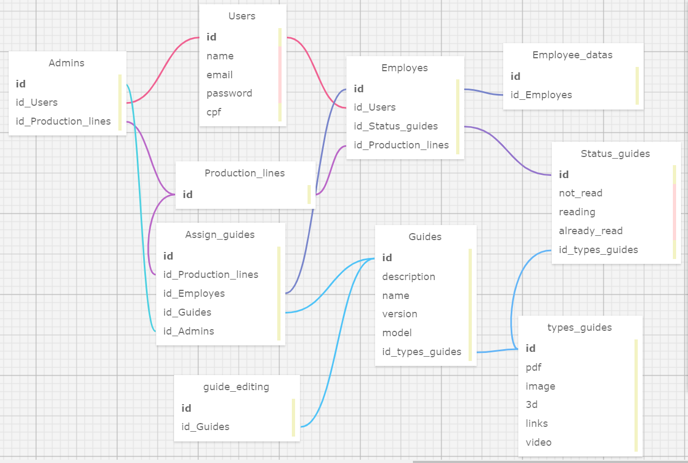

# Ponderada_3

 Atividade da semana 3, ponderada de programação, realizada pela aluna Iasmim Santos.

# Modelagem de Banco de Dados do Projeto para Dell Technologies




# Readme para Modelagem de Banco de Dados em Markdown
- Nome do Projeto: Modelagem de Banco de Dados do Projeto para Dell Technologies
- Descrição: O objetivo deste readme é apresentar a ponderada da semana 3, onde foi pedido para aplicar rigorosamente os princípios de relacionamento 1:N (um para muitos), N:N (muitos para muitos) e as conexões entre chaves primárias e estrangeiras, respeitando as regras de negócio definidas pelo seu parceiro desde a primeira sprint.
    O modelo é individual e apresenta uma documentação explicativa em markdown, link para um repositório próprio, contendo arquivos da modelagem (.xml) e documentação.
- Arquitetura: Banco de Dados Relacional
- Ferramenta de Diagramação: SQL Designer

# 1. Objetivo da Modelagem de Banco de Dados:

    Um modelo de banco de dados bem estruturado é crucial para garantir a eficiência, integridade e consistência dos dados em um sistema de gerenciamento de banco de dados (SGBD). Alguns benefícios-chave incluem:
    
1. Consistência de Dados: Define tipos de dados e restrições, evitando inconsistências e erros.
2. Integridade Referencial: Relacionamentos claros garantem que as chaves estrangeiras mantenham a consistência dos dados relacionados.
3. Eficiência de Consulta: Índices e consultas bem definidos melhoram o desempenho das operações de consulta.
Escalabilidade e Manutenção: Facilita a expansão e adaptação do banco de dados ao longo do tempo, com mudanças controladas.
4. Compreensão e Documentação: Serve como documentação clara da estrutura do banco de dados, facilitando o entendimento para desenvolvedores e administradores.

# 2. Explicando a Modelagem Relacional:

***Entidades e seus atributos, bem como os relacionamentos entre elas:***

## Users:
A entidade Users representa os usuários do sistema.
### Atributos:
- ID: Identificador único de cada usuário.
- Name: Nome do usuário.
- Email: Endereço de e-mail do usuário.
- Password: Senha do usuário para acesso ao sistema.
- CPF: Número do CPF do usuário.

## Admins:
Subclasse de usuários que possuem permissões administrativas adicionais.
### Atributos:
- ID: Identificador único do administrador.
- ID_Users: Chave estrangeira que referencia o ID do usuário associado.
- ID_Production_lines: Chave estrangeira que referencia as linhas de produção associadas ao administrador.

## Employes:
Representa os funcionários do sistema.
### Atributos:
- ID: Identificador único do funcionário.
- ID_Users: Chave estrangeira que referencia o ID do usuário associado.
- ID_Status_guides: Chave estrangeira que referencia o status do guia/manual associado ao funcionário.
- ID_Production_lines: Chave estrangeira que referencia a linha de produção associada ao funcionário.

## Guides:
Entidade que representa os guias do sistema.
### Atributos:
- ID: Identificador único do guia.
- Description: Descrição do guia.
- Name: Nome do guia.
- Version: Versão do guia.
- Model: Modelo do guia.
- ID_Types_guides: Chave estrangeira que referencia o tipo de guia associado.

## Status_guides:
Representa o status de leitura dos guias.
### Atributos:
- ID: Identificador único do status do guia.
- Not_read: Indica se o guia não foi lido.
- Reading: Indica se o guia está sendo lido.
- Already_read: Indica se o guia já foi lido.
- ID_Types_guides: Chave estrangeira que referencia o tipo de guia associado ao status.

## Types_guides:
Define os diferentes tipos de guias e seus atributos associados.
### Atributos:
- ID: Identificador único do tipo de guia.
- PDF: Indica se o guia possui versão em PDF.
- Image: Indica se o guia possui imagens associadas.
- 3D: Indica se o guia possui representação em 3D.
- Links: Indica se o guia possui links relacionados.
- Video: Indica se o guia possui vídeos associados.

## Production_lines:
Entidade que representa as linhas de produção.
### Atributos:
- ID: Identificador único da linha de produção.

## Assign_guides:
Relaciona funcionários, linhas de produção, guias e administradores.
### Atributos:
- ID: Identificador único da atribuição de guia.
- ID_Production_lines: Chave estrangeira que referencia a linha de produção associada à atribuição.
- ID_Employes: Chave estrangeira que referencia o funcionário associado à atribuição.
- ID_Guides: Chave estrangeira que referencia o guia associado à atribuição.
- ID_Admins: Chave estrangeira que referencia o administrador associado à atribuição.

## Employee_datas:
Armazena dados adicionais dos funcionários para os admins.
### Atributos:
- ID: Identificador único dos dados do funcionário.
- ID_Employes: Chave estrangeira que referencia o ID do funcionário associado.

## Guide_editing:
Registra as edições feitas nos guias.
### Atributos:
- ID: Identificador único da edição do guia.
- ID_Guides: Chave estrangeira que referencia o ID do guia associado à edição.

## Relacionamentos:

1. **Relacionamento 1:1**:
   - **Users - Admins**: Um usuário pode ter zero ou um registro na tabela Admins. Um registro na tabela Admins pertence a exatamente um usuário.
   - **Users - Employes**: Um usuário pode ter zero ou um registro na tabela Employes. Um registro na tabela Employes pertence a exatamente um usuário.

2. **Relacionamento 1:N**:
   - **Employes - Assign_guides**: Um funcionário pode ter muitos registros na tabela Assign_guides. Um registro na tabela Assign_guides pertence a exatamente um funcionário.
   - **Guides - Assign_guides**: Um guia pode estar associado a muitos registros na tabela Assign_guides. Um registro na tabela Assign_guides está associado a exatamente um guia.
   - **Production_lines - Assign_guides**: Uma linha de produção pode estar associada a muitos registros na tabela Assign_guides. Um registro na tabela Assign_guides está associado a exatamente uma linha de produção.
   - **Types_guides - Guides**: Um tipo de guia pode estar associado a muitos guias na tabela Guides. Um guia está associado a exatamente um tipo de guia.
   - **Status_guides - Guides**: Um status de guia pode estar associado a muitos guias na tabela Guides. Um guia está associado a exatamente um status de guia.
   - **Production_lines - Employes**: Uma linha de produção pode ter muitos funcionários associados. Um funcionário está associado a exatamente uma linha de produção.
   - **Production_lines - Admins**: Uma linha de produção pode ter muitos administradores associados. Um administrador está associado a exatamente uma linha de produção.

3. **Relacionamento N:N**:
   - **Employes - Guides**: Um funcionário pode ter muitos guias atribuídos. Um guia pode estar associado a muitos funcionários.
   - **Guides - Production_lines**: Um guia pode ser atribuído a muitas linhas de produção. Uma linha de produção pode ter muitos guias atribuídos.
   - **Guides - Admins**: Um guia pode ser atribuído por muitos administradores. Um administrador pode atribuir muitos guias.
   - **Guides - Types_guides**: Um guia pode pertencer a muitos tipos de guias. Um tipo de guia pode ter muitos guias associados.

# 3. Modelagem (.xml):

<?xml version="1.0" encoding="utf-8" ?>
 SQL XML created by WWW SQL Designer, https://github.com/ondras/wwwsqldesigner/ -->
 Active URL: http://127.0.0.1:8080/wwwsqldesigner/ 
<sql>
<datatypes db="postgresql">
	<group label="Numeric" color="rgb(238,238,170)">
		<type label="Integer" length="0" sql="INTEGER" re="INT" quote=""/>
		<type label="Small Integer" length="0" sql="SMALLINT" quote=""/>
		<type label="Big Integer" length="0" sql="BIGINT" quote=""/>
		<type label="Decimal" length="1" sql="DECIMAL" re="numeric" quote=""/>
		<type label="Serial" length="0" sql="SERIAL" re="SERIAL4" fk="Integer" quote=""/>
		<type label="Big Serial" length="0" sql="BIGSERIAL" re="SERIAL8" fk="Big Integer" quote=""/>
		<type label="Real" length="0" sql="BIGINT" quote=""/>
		<type label="Single precision" length="0" sql="FLOAT" quote=""/>
		<type label="Double precision" length="0" sql="DOUBLE" re="DOUBLE" quote=""/>
	</group>

	<group label="Character" color="rgb(255,200,200)">
		<type label="Char" length="1" sql="CHAR" quote="'"/>
		<type label="Varchar" length="1" sql="VARCHAR" re="CHARACTER VARYING" quote="'"/>
		<type label="Text" length="0" sql="TEXT" quote="'"/>
		<type label="Binary" length="1" sql="BYTEA" quote="'"/>
		<type label="Boolean" length="0" sql="BOOLEAN" quote="'"/>
	</group>

	<group label="Date &amp; Time" color="rgb(200,255,200)">
		<type label="Date" length="0" sql="DATE" quote="'"/>
		<type label="Time" length="1" sql="TIME" quote="'"/>
		<type label="Time w/ TZ" length="0" sql="TIME WITH TIME ZONE" quote="'"/>
		<type label="Interval" length="1" sql="INTERVAL" quote="'"/>
		<type label="Timestamp" length="1" sql="TIMESTAMP" quote="'"/>
		<type label="Timestamp w/ TZ" length="0" sql="TIMESTAMP WITH TIME ZONE" quote="'"/>
		<type label="Timestamp wo/ TZ" length="0" sql="TIMESTAMP WITHOUT TIME ZONE" quote="'"/>
	</group>

	<group label="Miscellaneous" color="rgb(200,200,255)">
		<type label="XML" length="1" sql="XML" quote="'"/>
		<type label="Bit" length="1" sql="BIT" quote="'"/>
		<type label="Bit Varying" length="1" sql="VARBIT" re="BIT VARYING" quote="'"/>
		<type label="Inet Host Addr" length="0" sql="INET" quote="'"/>
		<type label="Inet CIDR Addr" length="0" sql="CIDR" quote="'"/>
		<type label="Geometry" length="0" sql="GEOMETRY" quote="'"/>
        <type label="JSON" length="0" sql="JSON" quote="'"/>
        <type label="JSONB" length="0" sql="JSONB" quote="'"/>
	</group>

    </datatypes><table x="2201" y="2142" name="Users">
    <row name="id" null="0" autoincrement="1">
    <datatype>INTEGER</datatype>
    <default>NULL</default></row>
    <row name="name" null="0" autoincrement="0">
    <datatype>VARCHAR</datatype>
    <default>'NULL'</default></row>
    <row name="email" null="0" autoincrement="0">
    <datatype>VARCHAR</datatype>
    <default>'NULL'</default></row>
    <row name="password" null="0" autoincrement="0">
    <datatype>VARCHAR</datatype>
    <default>'NULL'</default></row>
    <row name="cpf" null="0" autoincrement="0">
    <datatype>INTEGER</datatype>
    <default>NULL</default></row>
    <key type="PRIMARY" name="">
    <part>id</part>
    </key>
    </table>
    <table x="1966" y="2199" name="Admins">
    <row name="id" null="1" autoincrement="1">
    <datatype>INTEGER</datatype>
    <default>NULL</default></row>
    <row name="id_Users" null="0" autoincrement="0">
    <datatype>INTEGER</datatype>
    <default>NULL</default><relation table="Users" row="id" />
    </row>
    <row name="id_Production_lines" null="1" autoincrement="0">
    <datatype>INTEGER</datatype>
    <default>NULL</default><relation table="Production_lines" row="id" />
    </row>
    <key type="PRIMARY" name="">
    <part>id</part>
    </key>
    </table>
    <table x="2383" y="2205" name="Employes">
    <row name="id" null="1" autoincrement="1">
    <datatype>INTEGER</datatype>
    <default>NULL</default></row>
    <row name="id_Users" null="0" autoincrement="0">
    <datatype>INTEGER</datatype>
    <default>NULL</default><relation table="Users" row="id" />
    </row>
    <row name="id_Status_guides" null="1" autoincrement="0">
    <datatype>INTEGER</datatype>
    <default>NULL</default><relation table="Status_guides" row="id" />
    </row>
    <row name="id_Production_lines" null="1" autoincrement="0">
    <datatype>INTEGER</datatype>
    <default>NULL</default><relation table="Production_lines" row="id" />
    </row>
    <key type="PRIMARY" name="">
    <part>id</part>
    </key>
    </table>
    <table x="2418" y="2414" name="Guides">
    <row name="id" null="1" autoincrement="1">
    <datatype>INTEGER</datatype>
    <default>NULL</default></row>
    <row name="description" null="0" autoincrement="0">
    <datatype>VARCHAR</datatype>
    <default>'NULL'</default></row>
    <row name="name" null="0" autoincrement="0">
    <datatype>VARCHAR</datatype>
    <default>'NULL'</default></row>
    <row name="version" null="0" autoincrement="0">
    <datatype>VARCHAR</datatype>
    <default>'NULL'</default></row>
    <row name="model" null="0" autoincrement="0">
    <datatype>VARCHAR</datatype>
    <default>'NULL'</default></row>
    <row name="id_types_guides" null="1" autoincrement="0">
    <datatype>INTEGER</datatype>
    <default>NULL</default><relation table="types_guides" row="id" />
    </row>
    <key type="PRIMARY" name="">
    <part>id</part>
    </key>
    </table>
    <table x="2636" y="2311" name="Status_guides">
    <row name="id" null="1" autoincrement="1">
    <datatype>INTEGER</datatype>
    <default>NULL</default></row>
    <row name="not_read" null="1" autoincrement="0">
    <datatype>BOOLEAN</datatype>
    <default>NULL</default></row>
    <row name="reading" null="1" autoincrement="0">
    <datatype>BOOLEAN</datatype>
    <default>NULL</default></row>
    <row name="already_read" null="1" autoincrement="0">
    <datatype>BOOLEAN</datatype>
    <default>NULL</default></row>
    <row name="id_types_guides" null="1" autoincrement="0">
    <datatype>INTEGER</datatype>
    <default>NULL</default><relation table="types_guides" row="id" />
    </row>
    <key type="PRIMARY" name="">
    <part>id</part>
    </key>
    </table>
    <table x="2595" y="2526" name="types_guides">
    <row name="id" null="1" autoincrement="1">
    <datatype>INTEGER</datatype>
    <default>NULL</default></row>
    <row name="pdf" null="0" autoincrement="0">
    <datatype>VARCHAR</datatype>
    <default>'NULL'</default></row>
    <row name="image" null="1" autoincrement="0">
    <datatype>INTERVAL</datatype>
    <default>NULL</default></row>
    <row name="3d" null="1" autoincrement="0">
    <datatype>VARCHAR</datatype>
    <default>NULL</default></row>
    <row name="links" null="1" autoincrement="0">
    <datatype>VARCHAR</datatype>
    <default>NULL</default></row>
    <row name="video" null="1" autoincrement="0">
    <datatype>VARCHAR</datatype>
    <default>NULL</default></row>
    <key type="PRIMARY" name="">
    <part>id</part>
    </key>
    </table>
    <table x="2148" y="2412" name="Assign_guides">
    <row name="id" null="1" autoincrement="1">
    <datatype>INTEGER</datatype>
    <default>NULL</default></row>
    <row name="id_Production_lines" null="1" autoincrement="0">
    <datatype>INTEGER</datatype>
    <default>NULL</default><relation table="Production_lines" row="id" />
    </row>
    <row name="id_Employes" null="1" autoincrement="0">
    <datatype>INTEGER</datatype>
    <default>NULL</default><relation table="Employes" row="id" />
    </row>
    <row name="id_Guides" null="1" autoincrement="0">
    <datatype>INTEGER</datatype>
    <default>NULL</default><relation table="Guides" row="id" />
    </row>
    <row name="id_Admins" null="1" autoincrement="0">
    <datatype>INTEGER</datatype>
    <default>NULL</default><relation table="Admins" row="id" />
    </row>
    <key type="PRIMARY" name="">
    <part>id</part>
    </key>
    </table>
    <table x="2172" y="2336" name="Production_lines">
    <row name="id" null="1" autoincrement="1">
    <datatype>INTEGER</datatype>
    <default>NULL</default></row>
    <key type="PRIMARY" name="">
    <part>id</part>
    </key>
    </table>
    <table x="2576" y="2190" name="Employee_datas">
    <row name="id" null="1" autoincrement="1">
    <datatype>INTEGER</datatype>
    <default>NULL</default></row>
    <row name="id_Employes" null="1" autoincrement="0">
    <datatype>INTEGER</datatype>
    <default>NULL</default><relation table="Employes" row="id" />
    </row>
    <key type="PRIMARY" name="">
    <part>id</part>
    </key>
    </table>
    <table x="2170" y="2600" name="guide_editing">
    <row name="id" null="1" autoincrement="1">
    <datatype>INTEGER</datatype>
    <default>NULL</default></row>
    <row name="id_Guides" null="1" autoincrement="0">
    <datatype>INTEGER</datatype>
    <default>NULL</default><relation table="Guides" row="id" />
    </row>
    <key type="PRIMARY" name="">
    <part>id</part>
    </key>
    </table>
    </sql>

***Passando o arquivo XML fornecido para PostgreSql:***
```
CREATE TABLE Users (
    id SERIAL PRIMARY KEY,
    name VARCHAR,
    email VARCHAR,
    password VARCHAR,
    cpf INTEGER
);

CREATE TABLE Admins (
    id SERIAL PRIMARY KEY,
    id_Users INTEGER,
    id_Production_lines INTEGER,
    FOREIGN KEY (id_Users) REFERENCES Users(id),
    FOREIGN KEY (id_Production_lines) REFERENCES Production_lines(id)
);

CREATE TABLE Employes (
    id SERIAL PRIMARY KEY,
    id_Users INTEGER,
    id_Status_guides INTEGER,
    id_Production_lines INTEGER,
    FOREIGN KEY (id_Users) REFERENCES Users(id),
    FOREIGN KEY (id_Status_guides) REFERENCES Status_guides(id),
    FOREIGN KEY (id_Production_lines) REFERENCES Production_lines(id)
);

CREATE TABLE Guides (
    id SERIAL PRIMARY KEY,
    description INTEGER,
    name INTEGER,
    version INTEGER,
    model INTEGER,
    id_types_guides INTEGER,
    FOREIGN KEY (id_types_guides) REFERENCES types_guides(id)
);

CREATE TABLE Status_guides (
    id SERIAL PRIMARY KEY,
    not_read BOOLEAN,
    reading BOOLEAN,
    already_read BOOLEAN,
    id_types_guides INTEGER,
    FOREIGN KEY (id_types_guides) REFERENCES types_guides(id)
);

CREATE TABLE types_guides (
    id SERIAL PRIMARY KEY,
    pdf INTEGER,
    image INTEGER,
    "3d" INTEGER,
    links INTEGER,
    video INTEGER
);

CREATE TABLE Assign_guides (
    id SERIAL PRIMARY KEY,
    id_Production_lines INTEGER,
    id_Employes INTEGER,
    id_Guides INTEGER,
    id_Admins INTEGER,
    FOREIGN KEY (id_Production_lines) REFERENCES Production_lines(id),
    FOREIGN KEY (id_Employes) REFERENCES Employes(id),
    FOREIGN KEY (id_Guides) REFERENCES Guides(id),
    FOREIGN KEY (id_Admins) REFERENCES Admins(id)
);

CREATE TABLE Production_lines (
    id SERIAL PRIMARY KEY
);

CREATE TABLE Employee_datas (
    id SERIAL PRIMARY KEY,
    id_Employes INTEGER,
    FOREIGN KEY (id_Employes) REFERENCES Employes(id)
);

CREATE TABLE guide_editing (
    id SERIAL PRIMARY KEY,
    id_Guides INTEGER,
    FOREIGN KEY (id_Guides) REFERENCES Guides(id)
);
